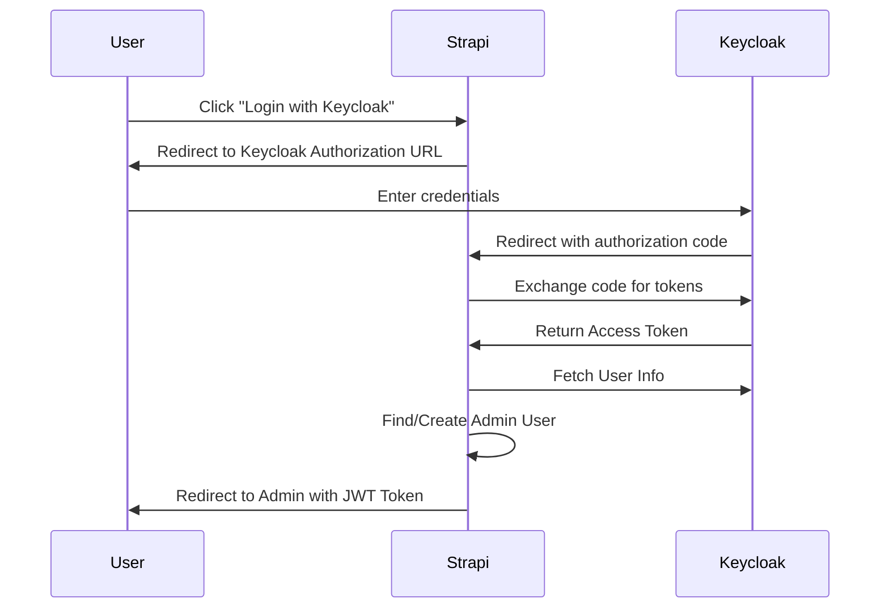
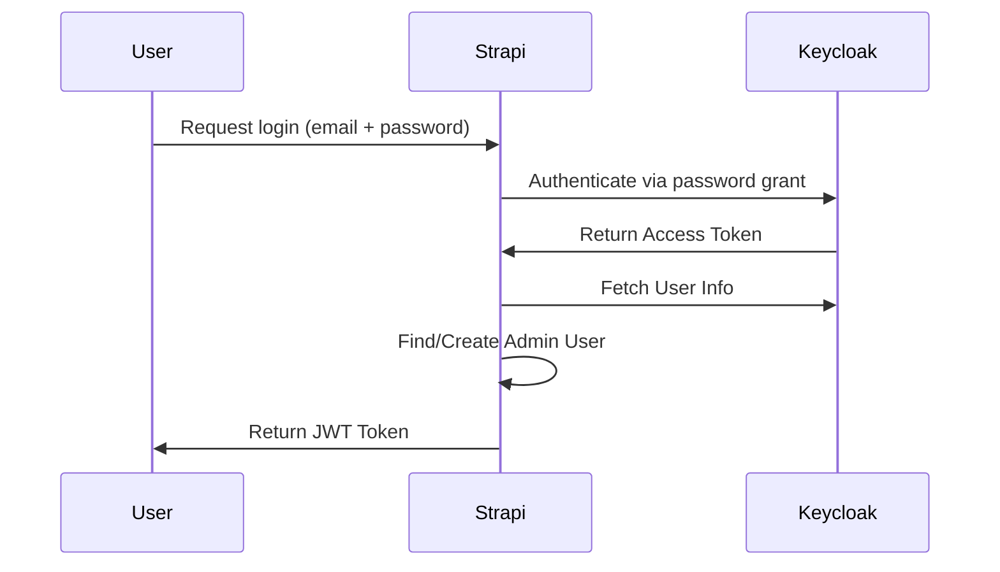

# 🔑 Strapi Keycloak Passport Plugin
🚀 **Seamlessly integrate Keycloak authentication with Strapi Admin Panel.**  
💼 **Enterprise-grade security, role-based access control (RBAC), and streamlined authentication.**  

## ✨ Features
✅ **🔐 Single Sign-On (SSO)** – Replace Strapi's default admin login with Keycloak authentication.  
✅ **🛡️ Role Mapping** – Dynamically map Keycloak roles to Strapi admin roles.  
✅ **⚡ Auto-Assign Default Role** – Ensure a default role (`STRAPI_ADMIN → Super Admin`) exists at first-time activation.  
✅ **🔍 Strapi RBAC Integration** – Leverage Strapi's native **Roles & Permissions** to enforce admin access.  
✅ **💾 Persistent Admin Session** – No redundant authentication; login once, persist across requests.  
✅ **📜 Full Logging & Debugging** – Logs every authentication & authorization event.  
✅ **🔄 Keycloak 18+ Support** – OAuth2 Authorization Code flow for modern Keycloak versions.  
✅ **🚪 Logout URL Support** – Properly terminate Keycloak sessions on logout.  

---

## 📋 Requirements

| Requirement | Version |
|-------------|---------|
| Node.js | `>=20.0.0` (including Node 22 and 24) |
| npm | `>=9.0.0` |
| Strapi | `v5.x` |
| Keycloak | `18+` (recommended) or legacy versions |

---

## 📦 Installation
```bash
yarn add strapi-keycloak-passport
```
or
```bash
npm install strapi-keycloak-passport
```

---

## ⚙️ Configuration
### 🔹 `config/plugins.js`
Add the following entry inside your `config/plugins.js` file:

#### For Keycloak 18+ (OAuth2 Authorization Code Flow - Recommended)
```javascript
module.exports = ({ env }) => ({
  'strapi-keycloak-passport': {
    enabled: env.bool('KEYCLOAK_PASSPORT_ACTIVE', true),
    config: {
      KEYCLOAK_AUTH_URL: env('KEYCLOAK_PASSPORT_AUTH_URL', 'https://keycloak.example.com'),
      KEYCLOAK_REALM: env('KEYCLOAK_PASSPORT_REALM', 'master'),
      KEYCLOAK_CLIENT_ID: env('KEYCLOAK_PASSPORT_CLIENT_ID', 'strapi-admin'),
      KEYCLOAK_CLIENT_SECRET: env('KEYCLOAK_PASSPORT_CLIENT_SECRET', 'your-secret'),
      KEYCLOAK_SCOPE: env('KEYCLOAK_SCOPE', 'openid email profile'),
      REMEMBER_ME: env.bool('REMEMBER_ME', false),
      // OAuth2 Authorization Code Flow (Keycloak 18+)
      KEYCLOAK_REDIRECT_URI: env('KEYCLOAK_PASSPORT_REDIRECT_URI', 'https://your-strapi-instance.com/strapi-keycloak-passport/callback'),
      KEYCLOAK_LOGOUT_REDIRECT_URI: env('KEYCLOAK_PASSPORT_LOGOUT_REDIRECT_URI', 'https://your-strapi-instance.com/admin/auth/login'),
      // For full URL format (recommended) - includes complete endpoint URLs
      KEYCLOAK_TOKEN_URL: env('KEYCLOAK_PASSPORT_TOKEN_URL', 'https://keycloak.example.com/realms/master/protocol/openid-connect/token'),
      KEYCLOAK_USERINFO_URL: env('KEYCLOAK_PASSPORT_USERINFO_URL', 'https://keycloak.example.com/realms/master/protocol/openid-connect/userinfo'),
      // Role mapping configuration
      roleConfigs: {
        defaultRoleId: env.int('KEYCLOAK_PASSPORT_DEFAULT_ROLE_ID', 3),
        superAdmin: {
          roleId: env.int('KEYCLOAK_PASSPORT_SUPER_ADMIN_ROLE_ID', 1),
          keycloakRole: env('KEYCLOAK_PASSPORT_SUPER_ADMIN_KEYCLOAK_ROLE', 'STRAPI_ADMIN'),
        },
        editor: {
          roleId: env.int('KEYCLOAK_PASSPORT_ADMIN_ROLE_ID', 2),
          keycloakRole: env('KEYCLOAK_PASSPORT_ADMIN_KEYCLOAK_ROLE', 'editor'),
        },
        author: {
          roleId: env.int('KEYCLOAK_PASSPORT_USER_ROLE_ID', 3),
          keycloakRole: env('KEYCLOAK_PASSPORT_USER_KEYCLOAK_ROLE', 'author'),
        },
        excludedRoles: env.array('KEYCLOAK_PASSPORT_EXCLUDED_ROLES', [
          'uma_authorization',
          'default-roles-NCR',
          'offline_access',
        ]),
      },
    },
  },
});
```

#### For Legacy Keycloak (< 18, Password Grant)
```javascript
module.exports = ({ env }) => ({
  'strapi-keycloak-passport': {
    enabled: env.bool('KEYCLOAK_PASSPORT_ACTIVE', true),
    config: {
      KEYCLOAK_AUTH_URL: env('KEYCLOAK_PASSPORT_AUTH_URL', 'https://keycloak.example.com/auth'),
      KEYCLOAK_REALM: env('KEYCLOAK_PASSPORT_REALM', 'master'),
      KEYCLOAK_CLIENT_ID: env('KEYCLOAK_PASSPORT_CLIENT_ID', 'strapi-admin'),
      KEYCLOAK_CLIENT_SECRET: env('KEYCLOAK_PASSPORT_CLIENT_SECRET', 'your-secret'),
      KEYCLOAK_SCOPE: env('KEYCLOAK_SCOPE', 'openid email profile'),
      REMEMBER_ME: env.bool('REMEMBER_ME', false),
      // Path-based URLs (legacy format)
      KEYCLOAK_TOKEN_URL: env('KEYCLOAK_PASSPORT_TOKEN_URL', '/realms/master/protocol/openid-connect/token'),
      KEYCLOAK_USERINFO_URL: env('KEYCLOAK_PASSPORT_USERINFO_URL', '/realms/master/protocol/openid-connect/userinfo'),
      // Role mapping configuration
      roleConfigs: {
        defaultRoleId: env.int('KEYCLOAK_PASSPORT_DEFAULT_ROLE_ID', 3),
        superAdmin: {
          roleId: env.int('KEYCLOAK_PASSPORT_SUPER_ADMIN_ROLE_ID', 1),
          keycloakRole: env('KEYCLOAK_PASSPORT_SUPER_ADMIN_KEYCLOAK_ROLE', 'STRAPI_ADMIN'),
        },
        editor: {
          roleId: env.int('KEYCLOAK_PASSPORT_ADMIN_ROLE_ID', 2),
          keycloakRole: env('KEYCLOAK_PASSPORT_ADMIN_KEYCLOAK_ROLE', 'editor'),
        },
        author: {
          roleId: env.int('KEYCLOAK_PASSPORT_USER_ROLE_ID', 3),
          keycloakRole: env('KEYCLOAK_PASSPORT_USER_KEYCLOAK_ROLE', 'author'),
        },
        excludedRoles: ['uma_authorization', 'default-roles-ncr', 'offline_access'],
      },
    },
  },
});
```

### 📋 Configuration Options

#### Core Authentication Settings

| Option | Type | Description | Required |
|--------|------|-------------|----------|
| `KEYCLOAK_AUTH_URL` | `string` | Base URL of your Keycloak server (e.g., `https://auth.example.com`) | ✅ Yes |
| `KEYCLOAK_REALM` | `string` | Keycloak realm name (e.g., `master`, `NCR`) | ✅ Yes |
| `KEYCLOAK_CLIENT_ID` | `string` | Client ID configured in Keycloak | ✅ Yes |
| `KEYCLOAK_CLIENT_SECRET` | `string` | Client secret from Keycloak | ✅ Yes |
| `KEYCLOAK_SCOPE` | `string` | OAuth2 scope (default: `openid email profile`) | Optional |
| `REMEMBER_ME` | `boolean` | Enable persistent sessions (default: `false`) | Optional |

#### OAuth2 Flow Settings (Keycloak 18+)

| Option | Type | Description | Required |
|--------|------|-------------|----------|
| `KEYCLOAK_REDIRECT_URI` | `string` | OAuth2 callback URL (e.g., `https://strapi.example.com/strapi-keycloak-passport/callback`) | For OAuth2 |
| `KEYCLOAK_LOGOUT_REDIRECT_URI` | `string` | URL to redirect after logout | Optional |

#### Endpoint URLs

| Option | Type | Description | Format Options |
|--------|------|-------------|----------------|
| `KEYCLOAK_TOKEN_URL` | `string` | Token endpoint URL | **Full URL** (recommended): `https://auth.example.com/realms/master/protocol/openid-connect/token`<br>**Path**: `/realms/master/protocol/openid-connect/token` |
| `KEYCLOAK_USERINFO_URL` | `string` | UserInfo endpoint URL | **Full URL** (recommended): `https://auth.example.com/realms/master/protocol/openid-connect/userinfo`<br>**Path**: `/realms/master/protocol/openid-connect/userinfo` |
| `KEYCLOAK_LOGOUT_URL` | `string` | Logout endpoint URL (optional) | **Full URL**: `https://auth.example.com/realms/master/protocol/openid-connect/logout`<br>**Path**: `/realms/master/protocol/openid-connect/logout` |

> **💡 Tip:** The plugin automatically detects whether you're using full URLs (starting with `http`) or path-based URLs and handles them accordingly.

#### Role Mapping Configuration

| Option | Type | Description | Default |
|--------|------|-------------|---------|
| `roleConfigs.defaultRoleId` | `number` | Default Strapi role ID when no Keycloak roles match | `3` |
| `roleConfigs.superAdmin.roleId` | `number` | Strapi role ID for super admin | `1` |
| `roleConfigs.superAdmin.keycloakRole` | `string` | Keycloak role name for super admin | `STRAPI_ADMIN` |
| `roleConfigs.editor.roleId` | `number` | Strapi role ID for editor | `2` |
| `roleConfigs.editor.keycloakRole` | `string` | Keycloak role name for editor | `editor` |
| `roleConfigs.author.roleId` | `number` | Strapi role ID for author | `3` |
| `roleConfigs.author.keycloakRole` | `string` | Keycloak role name for author | `author` |
| `roleConfigs.excludedRoles` | `string[]` | Array of Keycloak roles to ignore during mapping | `[]` |

### 🔧 Environment Variables

You can configure the plugin using environment variables in your `.env` file:

```bash
# Core Authentication
KEYCLOAK_PASSPORT_ACTIVE=true
KEYCLOAK_PASSPORT_AUTH_URL=https://auth.cyber-range.no
KEYCLOAK_PASSPORT_REALM=NCR
KEYCLOAK_PASSPORT_CLIENT_ID=strapi-admin
KEYCLOAK_PASSPORT_CLIENT_SECRET=your-secret-here
KEYCLOAK_SCOPE=openid email profile
REMEMBER_ME=false

# OAuth2 Flow (Keycloak 18+)
KEYCLOAK_PASSPORT_REDIRECT_URI=https://strapi.example.com/strapi-keycloak-passport/callback
KEYCLOAK_PASSPORT_LOGOUT_REDIRECT_URI=https://strapi.example.com/admin/auth/login

# Endpoint URLs (Full URL format - recommended)
KEYCLOAK_PASSPORT_TOKEN_URL=https://auth.cyber-range.no/realms/NCR/protocol/openid-connect/token
KEYCLOAK_PASSPORT_USERINFO_URL=https://auth.cyber-range.no/realms/NCR/protocol/openid-connect/userinfo
KEYCLOAK_PASSPORT_LOGOUT_URL=https://auth.cyber-range.no/realms/NCR/protocol/openid-connect/logout

# Role Mapping - Strapi Role IDs
KEYCLOAK_PASSPORT_DEFAULT_ROLE_ID=3
KEYCLOAK_PASSPORT_SUPER_ADMIN_ROLE_ID=1
KEYCLOAK_PASSPORT_ADMIN_ROLE_ID=2
KEYCLOAK_PASSPORT_USER_ROLE_ID=3

# Role Mapping - Keycloak Role Names
KEYCLOAK_PASSPORT_SUPER_ADMIN_KEYCLOAK_ROLE=STRAPI_ADMIN
KEYCLOAK_PASSPORT_ADMIN_KEYCLOAK_ROLE=editor
KEYCLOAK_PASSPORT_USER_KEYCLOAK_ROLE=author

# Excluded Roles (comma-separated - use lowercase for Keycloak default roles)
KEYCLOAK_PASSPORT_EXCLUDED_ROLES=uma_authorization,default-roles-ncr,offline_access
```

---

## 🛠 Setup in Keycloak

### 1️⃣ Create a Client

1. **Navigate to Keycloak Admin Panel**
   - Go to your Keycloak instance (e.g., `https://auth.example.com`)
   - Login with admin credentials
   - Select your realm (e.g., `master`, `NCR`)

2. **Create a New Client**
   - Go to **Clients** → Click **Create client**
   - **Client ID**: `strapi-admin` (or your preferred ID)
   - Click **Next**

3. **Configure Client Settings**
   - **Client authentication**: `ON` (for confidential clients)
   - **Authorization**: `OFF` (unless using Keycloak Authorization Services)
   - **Authentication flow**: Enable the following:
     - ✅ **Standard flow** (OAuth2 Authorization Code - Recommended for Keycloak 18+)
     - ✅ **Direct access grants** (Password grant - for legacy support or custom login UI)
   - Click **Next**

4. **Configure URLs**
   - **Root URL**: `https://your-strapi-instance.com`
   - **Home URL**: `https://your-strapi-instance.com/admin`
   - **Valid redirect URIs**:
     ```
     https://your-strapi-instance.com/strapi-keycloak-passport/callback
     https://your-strapi-instance.com/admin/*
     ```
   - **Valid post logout redirect URIs**:
     ```
     https://your-strapi-instance.com/admin/auth/login
     ```
   - **Web origins**: `https://your-strapi-instance.com` (for CORS)
   - Click **Save**

5. **Get Client Credentials**
   - Go to the **Credentials** tab
   - Copy the **Client Secret** (you'll need this for `KEYCLOAK_CLIENT_SECRET`)

### 2️⃣ Configure Client for Role Fetching (Required for Role Mapping)

For the plugin to fetch user roles from Keycloak, the client needs additional permissions:

1. **Navigate to Service Account Roles**
   - Go to your client → **Service accounts roles** tab
   - Click **Assign role**

2. **Assign Required Roles**
   - Filter by: **Filter by clients**
   - Search for: `realm-management`
   - Assign the following roles:
     - ✅ `view-users` (Required - allows reading user data)
     - ✅ `view-realm` (Optional - allows reading realm configuration)
     - ✅ `manage-users` (Optional - only if you need full user management)

3. **Verify Permissions**
   - The client can now fetch user roles via Keycloak Admin API
   - Without these roles, users will only get the `defaultRoleId`

### 3️⃣ Create Keycloak Roles

Create roles in Keycloak that will be mapped to Strapi admin roles:

1. **Navigate to Roles**
   - Go to **Realm roles** → Click **Create role**

2. **Create Roles**
   
   **Super Admin Role:**
   - **Role name**: `STRAPI_ADMIN` (or match your config: `KEYCLOAK_PASSPORT_SUPER_ADMIN_KEYCLOAK_ROLE`)
   - **Description**: `Strapi Super Administrator`
   - Click **Save**

   **Editor Role:**
   - **Role name**: `editor` (or match your config: `KEYCLOAK_PASSPORT_ADMIN_KEYCLOAK_ROLE`)
   - **Description**: `Strapi Content Editor`
   - Click **Save**

   **Author Role:**
   - **Role name**: `author` (or match your config: `KEYCLOAK_PASSPORT_USER_KEYCLOAK_ROLE`)
   - **Description**: `Strapi Content Author`
   - Click **Save**

### 4️⃣ Assign Roles to Users

1. **Navigate to Users**
   - Go to **Users** → Find the user
   - Click on the user

2. **Assign Roles**
   - Go to **Role mapping** tab
   - Click **Assign role**
   - Filter by: **Filter by realm roles**
   - Select the roles (e.g., `STRAPI_ADMIN`, `editor`, `author`)
   - Click **Assign**

### 5️⃣ Configure Scope (Optional but Recommended)

Ensure the client has the correct scope to access user information:

1. **Navigate to Client Scopes**
   - Go to your client → **Client scopes** tab
   - Ensure these are in **Assigned default client scopes**:
     - ✅ `email`
     - ✅ `profile`
     - ✅ `roles`

2. **Configure Token Claims** (if needed)
   - Go to **Client scopes** → `roles`
   - Ensure **Include in token scope** is enabled
   - This ensures roles are included in access tokens

### 6️⃣ Configuration Checklist

Before proceeding, verify:

- ✅ Client created with `Client authentication` enabled
- ✅ Client has **Standard flow** and/or **Direct access grants** enabled
- ✅ Valid redirect URIs configured
- ✅ Client secret copied
- ✅ Service account roles assigned (`view-users` minimum)
- ✅ Realm roles created (`STRAPI_ADMIN`, `editor`, `author`)
- ✅ Roles assigned to test users
- ✅ Client scopes include `email`, `profile`, `roles`

### 🔍 Testing Keycloak Configuration

Test your Keycloak setup before integrating with Strapi:

**Test OAuth2 Authorization Flow:**
```bash
# Get authorization URL (replace with your values)
REALM=NCR
CLIENT_ID=strapi-admin
REDIRECT_URI=https://your-strapi-instance.com/strapi-keycloak-passport/callback
AUTH_URL=https://auth.example.com/realms/${REALM}/protocol/openid-connect/auth

# Open in browser:
${AUTH_URL}?client_id=${CLIENT_ID}&response_type=code&redirect_uri=${REDIRECT_URI}&scope=openid%20email%20profile
```

**Test Token Endpoint (Password Grant):**
```bash
curl -X POST "https://auth.example.com/realms/NCR/protocol/openid-connect/token" \
  -H "Content-Type: application/x-www-form-urlencoded" \
  -d "client_id=strapi-admin" \
  -d "client_secret=your-secret" \
  -d "username=user@example.com" \
  -d "password=userpassword" \
  -d "grant_type=password" \
  -d "scope=openid email profile"
```

**Test UserInfo Endpoint:**
```bash
# Use access_token from above
curl -X GET "https://auth.example.com/realms/NCR/protocol/openid-connect/userinfo" \
  -H "Authorization: Bearer YOUR_ACCESS_TOKEN"
```

### 🚨 Common Keycloak Configuration Issues

| Issue | Solution |
|-------|----------|
| **Invalid redirect_uri** | Ensure redirect URI exactly matches in both Keycloak and Strapi config |
| **Unauthorized client** | Check client authentication is enabled and client secret is correct |
| **User cannot login** | Verify user has at least one role assigned |
| **Role mapping fails** | Ensure client has `view-users` service account role |
| **CORS errors** | Add Strapi URL to **Web origins** in client settings |
| **Token expired** | Check token lifetime settings in Realm → **Tokens** tab |
| **Scope errors** | Ensure `openid email profile` scopes are enabled |

---

## 🔐 Role-Based Access Control (RBAC)

The plugin provides **configuration-based role mapping** that automatically maps Keycloak roles to Strapi admin roles. This eliminates the need for database-based role management and provides a more maintainable, version-controlled approach.

### 🎯 How Role Mapping Works

When a user authenticates via Keycloak:

1. **Fetch User Roles** - The plugin retrieves all roles assigned to the user in Keycloak
2. **Filter Excluded Roles** - Roles in the `excludedRoles` list are removed (e.g., system roles like `uma_authorization`)
3. **Map to Strapi Roles** - Each Keycloak role is checked against your configured mappings
4. **Assign Roles** - Matching Strapi role IDs are assigned to the user
5. **Fallback to Default** - If no roles match, the user gets the `defaultRoleId`

### 🛠 Configuring Role Mappings

Role mappings are defined in your `config/plugins.js` file under `roleConfigs`:

```javascript
roleConfigs: {
  // Default role assigned when no Keycloak roles match
  defaultRoleId: env.int('KEYCLOAK_PASSPORT_DEFAULT_ROLE_ID', 3),
  
  // Map Keycloak "STRAPI_ADMIN" role to Strapi Super Admin (role ID 1)
  superAdmin: {
    roleId: env.int('KEYCLOAK_PASSPORT_SUPER_ADMIN_ROLE_ID', 1),
    keycloakRole: env('KEYCLOAK_PASSPORT_SUPER_ADMIN_KEYCLOAK_ROLE', 'STRAPI_ADMIN'),
  },
  
  // Map Keycloak "editor" role to Strapi Editor (role ID 2)
  editor: {
    roleId: env.int('KEYCLOAK_PASSPORT_ADMIN_ROLE_ID', 2),
    keycloakRole: env('KEYCLOAK_PASSPORT_ADMIN_KEYCLOAK_ROLE', 'editor'),
  },
  
  // Map Keycloak "author" role to Strapi Author (role ID 3)
  author: {
    roleId: env.int('KEYCLOAK_PASSPORT_USER_ROLE_ID', 3),
    keycloakRole: env('KEYCLOAK_PASSPORT_USER_KEYCLOAK_ROLE', 'author'),
  },
  
  // Roles to ignore during mapping
  excludedRoles: env.array('KEYCLOAK_PASSPORT_EXCLUDED_ROLES', [
    'uma_authorization',
    'default-roles-NCR',
    'offline_access',
  ]),
}
```

### 📊 Role Mapping Examples

#### Example 1: Super Admin Only

```javascript
roleConfigs: {
  defaultRoleId: 3, // Author role as default
  superAdmin: {
    roleId: 1,
    keycloakRole: 'STRAPI_ADMIN',
  },
  excludedRoles: ['uma_authorization', 'offline_access'],
}
```

**Result:**
- User with `STRAPI_ADMIN` role → Gets Strapi Super Admin (ID 1)
- User with `editor` role → Gets default Author role (ID 3)
- User with no roles → Gets default Author role (ID 3)

#### Example 2: Multiple Role Mappings

```javascript
roleConfigs: {
  defaultRoleId: 3,
  superAdmin: {
    roleId: 1,
    keycloakRole: 'admin',
  },
  editor: {
    roleId: 2,
    keycloakRole: 'editor',
  },
  author: {
    roleId: 3,
    keycloakRole: 'author',
  },
  excludedRoles: ['uma_authorization', 'offline_access'],
}
```

**Result:**
- User with `admin` role → Gets Super Admin (ID 1)
- User with `editor` role → Gets Editor (ID 2)
- User with `author` role → Gets Author (ID 3)
- User with `viewer` role → Gets default Author (ID 3)
- User with multiple roles (`admin` + `editor`) → Gets both Super Admin and Editor roles

#### Example 3: Custom Role Names

```javascript
roleConfigs: {
  defaultRoleId: 4, // Custom viewer role
  superAdmin: {
    roleId: 1,
    keycloakRole: 'strapi-super-admin',
  },
  contentManager: {
    roleId: 5,
    keycloakRole: 'content-manager',
  },
  translator: {
    roleId: 6,
    keycloakRole: 'translator',
  },
  excludedRoles: ['default-roles-myapp', 'offline_access'],
}
```

### 🔍 Finding Strapi Role IDs

To find the correct Strapi role IDs for mapping:

1. **Via Admin Panel:**
   - Go to **Settings** → **Administration Panel** → **Roles**
   - The role ID is visible in the URL: `/admin/settings/roles/{roleId}`

2. **Via Database:**
   ```sql
   SELECT id, name, description FROM admin_roles;
   ```

3. **Via Strapi Console:**
   ```javascript
   const roles = await strapi.query('admin::role').findMany();
   console.table(roles);
   ```

### 📋 Default Strapi Admin Roles

| Role | ID | Description |
|------|----|----|
| Super Admin | `1` | Full access to all features |
| Editor | `2` | Can manage content |
| Author | `3` | Can create and edit own content |

### 🚫 Excluded Roles

Some Keycloak roles are system-level or irrelevant to Strapi. Add these to `excludedRoles`:

**Common excluded roles:**
- `uma_authorization` - Keycloak authorization service role
- `offline_access` - OAuth2 offline access scope
- `default-roles-{realm}` - Default realm roles (e.g., `default-roles-ncr` - use lowercase)
- Client-specific roles that shouldn't grant Strapi access

**Important:** Keycloak default roles are typically lowercase (e.g., `default-roles-ncr`, not `default-roles-NCR`). If excluded roles aren't filtering properly, check the case sensitivity of your role names.

### ⚙️ Advanced Configuration

#### Adding Custom Role Mappings

You can add as many role mappings as needed:

```javascript
roleConfigs: {
  defaultRoleId: 3,
  superAdmin: { roleId: 1, keycloakRole: 'admin' },
  editor: { roleId: 2, keycloakRole: 'editor' },
  author: { roleId: 3, keycloakRole: 'author' },
  translator: { roleId: 4, keycloakRole: 'translator' },
  reviewer: { roleId: 5, keycloakRole: 'reviewer' },
  marketingManager: { roleId: 6, keycloakRole: 'marketing-manager' },
  excludedRoles: ['uma_authorization', 'offline_access'],
}
```

#### Minimal Configuration

If you only need super admin mapping:

```javascript
roleConfigs: {
  defaultRoleId: 3,
  superAdmin: {
    roleId: 1,
    keycloakRole: 'STRAPI_ADMIN',
  },
  excludedRoles: ['uma_authorization', 'offline_access'],
}
```

**Note:** You can omit `editor` and `author` if you don't need those mappings. Users without matching roles will receive the `defaultRoleId`.

### 🔐 Security Best Practices

1. **Use Descriptive Keycloak Role Names** - Make roles easy to identify (e.g., `strapi-super-admin` instead of `admin`)
2. **Set Appropriate Default Role** - Assign the least privileged role as default (usually Author or Viewer)
3. **Exclude System Roles** - Always exclude Keycloak system roles to prevent unintended access
4. **Regular Audit** - Review role mappings periodically to ensure they match your security requirements
5. **Environment-Specific Roles** - Use different role names for dev/staging/production environments

### 📝 Troubleshooting Role Mapping

**Enable debug logging** to see detailed role mapping information:

```bash
# Start Strapi with debug logging
DEBUG=strapi:* yarn develop
```

**Check logs for:**
- `🔍 Keycloak roles received:` - Shows all roles from Keycloak
- `🔍 Filtered roles (excluded removed):` - Shows roles after exclusion
- `🔍 Mapped {keycloakRole} -> Strapi role {roleId}` - Shows successful mappings
- `🔍 No matching role mappings found, will use default role` - User gets default role

**Common Issues:**

1. **Role names don't match** - Ensure Keycloak role names exactly match `keycloakRole` values (case-sensitive)
2. **Wrong role IDs** - Verify Strapi role IDs in database or admin panel
3. **Roles not fetching** - Check that Keycloak client has proper permissions (`view-users`, `manage-users`)
4. **All users get default role** - Check that `excludedRoles` isn't filtering out all roles  

---

## 🔄 Authentication Flows

### OAuth2 Authorization Code Flow (Keycloak 18+)



### Legacy Password Grant Flow (Keycloak < 18)



✅ **Admin logs in once** → session persists, no re-authentication needed on every request.  

---

## 📜 API Endpoints

### Authentication Endpoints

| Method | Endpoint | Description | Auth Required |
|--------|---------|-------------|--------------|
| `POST` | `/admin/login` | Authenticate admin via Keycloak (password grant) | ❌ No |
| `GET` | `/authorize` | Initiate OAuth2 Authorization Code flow | ❌ No |
| `GET` | `/callback` | OAuth2 callback endpoint | ❌ No |
| `GET` | `/authorization-url` | Get Keycloak authorization URL | ❌ No |
| `GET` | `/logout-url` | Get Keycloak logout URL (client-managed) | ❌ No |
| `POST` | `/logout` | Complete logout with session cleanup and token revocation | ❌ No |

### Role Management Endpoints

| Method | Endpoint | Description | Auth Required |
|--------|---------|-------------|---------------|
| `GET` | `/keycloak-roles` | Fetch available Keycloak roles (read-only view) | ✅ Yes |
| `GET` | `/get-keycloak-role-mappings` | Get configured role mappings (read-only) | ✅ Yes |

---

## 🎨 Admin Panel

The plugin adds a **Passport Role Mapping** page to the Strapi admin panel under **Settings** → **Passport Role Mapping**.

### Role Mapping View (Read-Only)

The admin panel displays a read-only view of your role mappings:

**What it shows:**
- ✅ All available Keycloak roles (excluding system roles)
- ✅ Currently mapped Strapi roles for each Keycloak role
- ✅ Role mappings configured via environment variables

**Important:**
- 📖 **Read-Only Display** - Role mappings cannot be edited through the UI
- ⚙️ **Configuration-Based** - All role mappings are managed via `config/plugins.js` or environment variables
- 🔄 **Auto-Updated** - The view reflects your current configuration on each page load

**Why read-only?**
Role mappings are infrastructure configuration that should be:
- Version-controlled alongside your codebase
- Consistent across environments (dev, staging, production)
- Changed through your deployment process, not ad-hoc UI edits

To modify role mappings:
1. Update `config/plugins.js` or environment variables
2. Redeploy your Strapi application
3. Role mappings will be automatically applied on next login

---

## 🚪 Logout Support

The plugin provides **two logout methods**: a complete server-side logout endpoint and a client-managed logout flow.

### ✅ Method 1: Server-Side Logout (Recommended)

The `/logout` endpoint performs a complete logout with session cleanup and token revocation:

**What it does:**
1. ✅ Destroys Strapi admin session using session manager
2. ✅ Clears `strapi_admin_refresh` cookie
3. ✅ Revokes Keycloak refresh tokens via token revocation endpoint
4. ✅ Redirects to Keycloak logout URL to terminate SSO session
5. ✅ Keycloak redirects back to your app's login page

**Usage:**
```javascript
// Simple POST request to logout endpoint
await fetch('/strapi-keycloak-passport/logout', {
  method: 'POST',
  credentials: 'include', // Include cookies
});

// Browser will be automatically redirected to Keycloak logout,
// then back to your login page
```

**Or using a form:**
```html
<form action="/strapi-keycloak-passport/logout" method="POST">
  <button type="submit">Logout</button>
</form>
```

**Configuration:**
```bash
# Optional: Keycloak logout endpoint (auto-detected if not provided)
KEYCLOAK_PASSPORT_LOGOUT_URL=https://auth.example.com/realms/NCR/protocol/openid-connect/logout

# Where to redirect after Keycloak logout completes
KEYCLOAK_PASSPORT_LOGOUT_REDIRECT_URI=https://your-app.com/admin/auth/login
```

### 🔄 Method 2: Client-Managed Logout

For custom logout flows, you can manually manage each step:

**Step 1: Get logout URL**
```javascript
const response = await fetch('/strapi-keycloak-passport/logout-url');
const { logoutUrl } = await response.json();
// Returns: https://auth.example.com/realms/NCR/protocol/openid-connect/logout?client_id=...
```

**Step 2: Clear local session**
```javascript
// Clear any local JWT tokens
localStorage.removeItem('jwtToken');
sessionStorage.clear();
```

**Step 3: Redirect to Keycloak**
```javascript
window.location.href = logoutUrl;
```

### 🔧 Logout Endpoint Configuration

The logout endpoint supports both **full URL** and **path-based** configuration:

**Full URL (Recommended):**
```javascript
KEYCLOAK_LOGOUT_URL: 'https://auth.example.com/realms/NCR/protocol/openid-connect/logout'
```

**Path-based:**
```javascript
KEYCLOAK_LOGOUT_URL: '/realms/NCR/protocol/openid-connect/logout'
```

**Auto-detection (if not provided):**
```javascript
// Automatically constructs: {KEYCLOAK_AUTH_URL}/realms/{REALM}/protocol/openid-connect/logout
```

### 🔍 Token Revocation

The logout endpoint automatically revokes Keycloak tokens using the **token revocation endpoint**:

**Revocation URL construction:**
- **If `KEYCLOAK_TOKEN_URL` is full URL:** Extracts base and uses `/protocol/openid-connect/revoke`
- **If path-based:** Replaces `/token` with `/revoke`
- **Fallback:** Constructs from base URL and realm

**What gets revoked:**
- Refresh token from `strapi_admin_refresh` cookie
- Prevents token reuse after logout
- Invalidates SSO session

### ⚠️ Logout Flow Comparison

| Feature | Server-Side (`POST /logout`) | Client-Managed (`GET /logout-url`) |
|---------|------------------------------|------------------------------------|
| Session cleanup | ✅ Automatic | ❌ Manual |
| Cookie clearing | ✅ Automatic | ❌ Manual |
| Token revocation | ✅ Automatic | ❌ Manual |
| Keycloak logout | ✅ Automatic redirect | ⚠️ Manual redirect |
| Error handling | ✅ Built-in | ❌ Client responsibility |
| Ease of use | ✅ Single POST request | ⚠️ Multiple steps |
| **Recommended** | ✅ **Yes** | For custom flows only |

### 🐛 Troubleshooting Logout

**Issue: Logout doesn't clear session**
- Solution: Use `POST /logout` endpoint instead of `GET /logout-url`
- Check: Ensure cookies are included in request (`credentials: 'include'`)

**Issue: Still logged in after logout**
- Solution: Verify `KEYCLOAK_LOGOUT_URL` is correct
- Check: Keycloak client has proper logout redirect URIs configured

**Issue: Token revocation fails**
- Solution: Check Keycloak client credentials are correct
- Note: Logout will continue even if revocation fails (graceful degradation)

**Issue: Redirect not working**
- Solution: Verify `KEYCLOAK_LOGOUT_REDIRECT_URI` is in Keycloak's allowed post-logout redirect URIs
- Check: URL must exactly match (including protocol, domain, and path)

---

## 🚀 Next-Level Security
| Feature | Status |
|---------|--------|
| ✅ OAuth2 Authorization Code Flow | ✔ Keycloak 18+ |
| ✅ Legacy Password Grant | ✔ Keycloak < 18 |
| ✅ Keycloak Logout Integration | ✔ Session Termination |
| ✅ Session-Based Persistence | ✔ Secure |
| ✅ Role-Based Access Control (RBAC) | ✔ Strapi Admin Integration |
| ✅ Middleware Protection | ✔ Only Authorized Users Access APIs |
| ✅ CSRF Protection | ✔ State Parameter Validation |

---

## 🎯 Final Command to Rule Them All
```bash
yarn develop
```
🔥 **Your Strapi is now fully Keycloak-powered!** 🔥  
